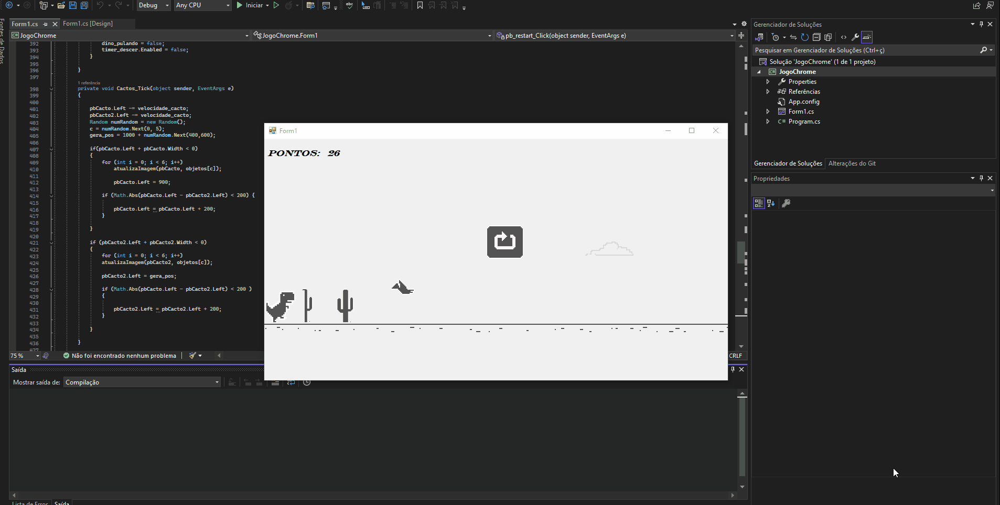

<h1 align="center">ChromeGame_WindowsForms</h1>

<p align="center"> projeto feito para aprendizado de timers no Windows Forms (.NET Framework)...  </p>


<h1 align="center">
   
 </h1>


# Sobre
<p>Com o inicio do meu aprendizado em Aplicativos desktops (windowsForms), precisava aprender a manipular imagens e timers. assim tive a ideia de recriar o Jogo do Chrome em c#</p>

<br>

## Instalação

```bash
1- Faça o download do arquivo
$ Arquivo: programamacao.zip

2- acessar o diretorio:
$ - progamacao\trabalhofinalPROG\JogoChrome\JogoChrome\bin\Debug

3- clique no executor e jogue!!
```
<br>

## Tecnologias

 - .NET Framework
 - C#
 - Windows Forms
 - Visual Studio

# Contatos

<p> Linkedin: 
  <a href="www.linkedin.com/in/gabrielplamer">gabrielplamer</a>
</p>
<p> Email: gabrielplamerif@gmail.com
</p>
<p> Contato: 53999602701
</p>


